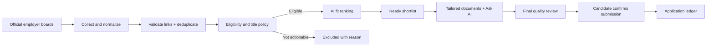

# Job Search Agent

A private, mobile-friendly job-application assistant for finding fresh, eligible software-engineering opportunities; ranking them against a real candidate profile; preparing grounded application material; and safely assisting with submission.

The goal is **a small, explainable shortlist of worthwhile roles**, not thousands of unfiltered listings.

> Full product, architecture, prompt, security, and roadmap reference: [Job Search Agent Blueprint](docs/job-search-agent-blueprint.md)

## What it does

- Collects jobs from official Greenhouse, Lever, and Ashby employer boards, plus individual job URLs supplied by the user.
- Treats Adzuna, RemoteOK, and We Work Remotely as optional discovery sources rather than application sources.
- Removes broken/expired links, duplicates, unsuitable titles, and roles incompatible with the candidate's work-authorisation policy.
- Ranks roles, tracks pipeline status, and shows a responsive React mobile/PWA interface.
- Generates tailored resumes, cover letters, gap analyses, and grounded application answers.
- Provides a private Telegram companion for notifications, documents, queue preparation, and exceptions.
- Supports incremental ATS automation while stopping for CAPTCHA, OTP/2FA, unclear questions, sponsorship ambiguity, and unsupported forms.
- Records application attempts and only marks a role as applied after confirmation is observed.

## Application lifecycle



Pipeline states: `new` → `matched` → `drafted` → `applied` → `interviewing` / `rejected` / `offer`.

## Current model configuration

The checked-in code supports multiple providers. Current local configuration uses:

| Capability | Current model/approach |
|---|---|
| Semantic similarity | Ollama `nomic-embed-text` |
| Bulk ranking | OpenAI `gpt-4o-mini` when `RANK_PROVIDER=openai`; otherwise Ollama `llama3.2` |
| Drafting and Ask AI | OpenAI `gpt-4o` when `DRAFT_PROVIDER=openai` |
| Local fallback drafting | Ollama `llama3.2` |

The agreed quality-first routing to implement next is:

| Stage | Intended model |
|---|---|
| Fresh, policy-eligible job assessment | GPT-5 |
| Tailored resume, cover letter, and Ask AI | Claude Opus 4.1 |
| Final factual/quality audit | GPT-5 |

Model IDs must be validated against the account that owns the API key. Provider keys and model settings stay in the ignored local `.env`; they are never committed.

## Source and eligibility policy

### Source priority

1. **Official employer ATS feeds** — actionable source of truth.
2. **A user-supplied job URL** — parsed and assessed directly.
3. **Aggregators** — discovery only; their listings may be stale, region-restricted, or incomplete.

### Eligibility

The user-maintained ignored configuration files determine target titles, countries, remote policy, sponsorship requirements, and pre-approved form answers:

- `config/preferences.yaml`
- `config/answers.yaml`

The matcher produces labels such as `worldwide`, `sponsors`, `restricted`, `no-sponsorship`, `unknown`, and `title-filtered`. Explicit employer wording always wins: the system never overrides a clear “existing work authorisation required” or “no visa sponsorship” statement.

Jobs with unknown sponsorship can be reviewed, but must not be silently submitted.

## Safety boundaries

The agent may prepare a supported employer form, upload approved documents, and fill pre-approved factual answers. It must stop and notify the user for:

- CAPTCHA or bot challenges;
- OTP, MFA, email/SMS verification;
- subjective, unfamiliar, legal, or ambiguous questions;
- missing/invalid uploads;
- unclear work authorisation or sponsorship;
- unsupported ATS pages.

An application is only marked `applied` after an employer confirmation page is observed. The system never bypasses security controls or fabricates candidate facts.

## Architecture

```text
React + TypeScript PWA
          │ relative /api requests
FastAPI + Python workers ───── SQLite job/application ledger
          │                  ├── source adapters + validators
          │                  ├── matching + drafting
          │                  ├── ATS automation
          │                  └── Telegram companion
          ├── Ollama local models
          ├── OpenAI API
          └── Anthropic API

iPhone / browser → Cloudflare Access → Cloudflare Tunnel → local FastAPI host
```

The production personal deployment runs on an always-on Mac. Cloudflare Tunnel provides an outbound-only connection to the local service, while Cloudflare Access protects the public HTTPS hostname. The backend port is not exposed through router port-forwarding.

## Quick start

### 1. Install dependencies

```bash
python3 -m venv .venv
source .venv/bin/activate
pip install -e ".[web]"

cd web
npm install
npm run build
cd ..
```

### 2. Configure local-only files

```bash
cp .env.example .env
cp config/preferences.example.yaml config/preferences.yaml
cp config/answers.example.yaml config/answers.yaml
```

Add provider keys only to `.env`. Put actual candidate preferences and answers only in the ignored `config/*.yaml` files.

Place candidate resumes in `resumes/`. Generated documents are stored under `output/`.

### 3. Optional local models

```bash
ollama pull nomic-embed-text
ollama pull llama3.2
```

### 4. Run locally

```bash
uvicorn jobagent.api.main:app --host 0.0.0.0 --port 8842
```

Open `http://127.0.0.1:8842`.

The built frontend and API share the same FastAPI origin. This is important for Cloudflare Tunnel: the frontend uses relative `/api/...` URLs and never tries to expose port `8842` publicly.

## Key commands

```bash
jobagent fetch                      # Fetch configured sources
jobagent fetch --url <job-url>      # Add one job URL supplied by the candidate
jobagent match --limit N            # Apply title/eligibility/ranking flow
jobagent review                     # View top matching roles
jobagent draft <job_id>             # Generate tailored materials
jobagent gaps <job_id>              # Compare a role with the candidate profile
jobagent status                     # Inspect pipeline state
jobagent autopilot --limit N        # Prepare strict eligible roles; never silently submits
```

## Web and mobile UI

The React interface includes:

- Today/Ready queue with search and role/location filters;
- Applications and Excluded views;
- role details, original posting, eligibility evidence, and status actions;
- cover-letter and resume downloads/sharing designed for iPhone PWA use;
- Ask AI grounded in the selected company/job and approved candidate evidence;
- direct-apply preparation and clear exception states.

For iPhone use, open the protected HTTPS hostname in Safari and choose **Share → Add to Home Screen**.

## Telegram companion

Telegram is optional and private. It uses long polling and accepts actions only from `TELEGRAM_ALLOWED_CHAT_ID`.

Useful commands include:

```text
/today
/matches
/autopilot
/status
/help
```

The bot can deliver generated documents, send exception notifications, and expose confirmation controls. It never sends API keys and never bypasses the final safety conditions described above.

## Deployment on an always-on Mac

The application uses macOS `launchd` to keep the API, Telegram bot, and Cloudflare Tunnel running at login. Install/copy the provided launch-agent templates as appropriate for the local environment.

For the public personal hostname:

1. Register a domain and manage its DNS with Cloudflare.
2. Create a named Cloudflare Tunnel pointing the hostname at `http://127.0.0.1:8842`.
3. Protect the hostname with a Cloudflare Access allow policy.
4. Keep the Mac powered, logged in, and configured not to sleep while it is serving the application.

Cloudflare credentials belong under the user’s local `~/.cloudflared/` directory and must never be copied into this repository.

## Repository privacy rules

The following are intentionally ignored by Git:

- `.env` and provider keys;
- actual candidate preferences/answers;
- resumes and generated documents;
- SQLite database and logs;
- Cloudflare credentials/configuration;
- browser/Playwright sessions.

Before committing, inspect the staged diff and run a secret scan. Never commit real candidate data or infrastructure credentials.

## Roadmap

Near-term priorities:

1. Configurable premium model router, budget limits, and per-model spend tracking.
2. GPT-5 fit ranking for fresh, policy-eligible direct roles.
3. Claude Opus 4.1 grounded document/Ask-AI routing.
4. GPT-5 final factual application audit.
5. Better paginated job-list API for large datasets and friendlier Cloudflare Access login.
6. Additional verified ATS handlers and a stronger application exception queue.

Longer term, the project can become a multi-user product with application-level authentication, a multi-tenant database, encrypted per-user credentials, model tiers, subscription/budget controls, and strict data isolation.

## License

See [LICENSE](LICENSE).
