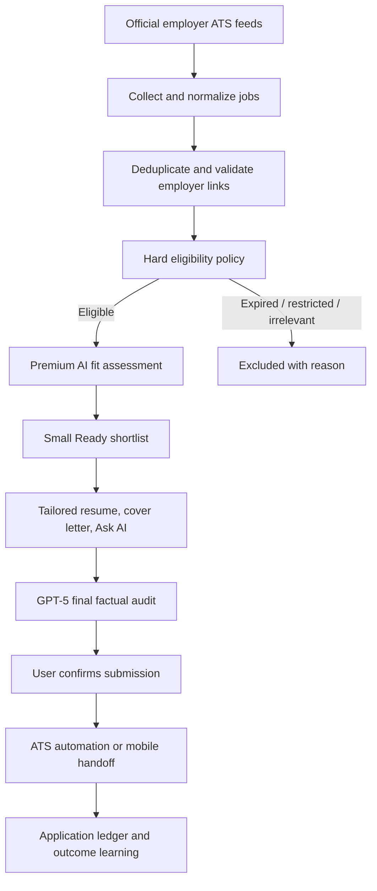
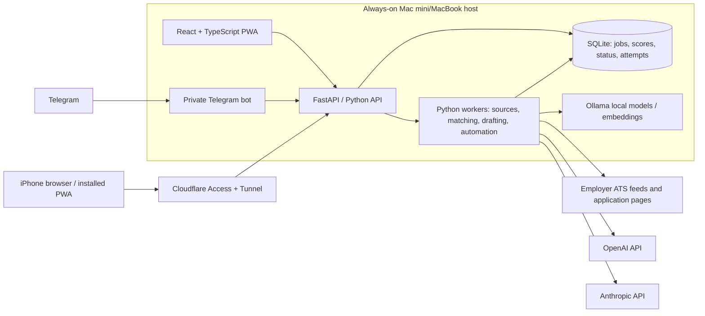

# Job Search Agent — Product and Technical Blueprint

## 1. Purpose

Job Search Agent is a private, mobile-friendly application assistant for a software engineer pursuing high-quality roles internationally. Its job is **not** to generate the largest possible list of postings. Its job is to identify a small, explainable shortlist of roles worth applying to, prepare accurate application material, help answer employer questions, and safely assist with submission.

The central product promise is:

> Find fresh, eligible, high-value opportunities; use only truthful candidate evidence; and keep the candidate in control of consequential actions.

The immediate user profile is focused on Forward Deployed Engineer (FDE), Senior Software Engineer, Staff Software Engineer, backend, platform, Java, and related roles. The candidate is based in the UAE, is open to Europe and worldwide remote work, and requires employer sponsorship for relocation/on-site work where applicable.

This blueprint deliberately avoids storing real resumes, contact details, API keys, tokens, SSH material, or personal answer files. Those belong only in ignored local files.

---

## 2. Product outcomes

### What success looks like

1. The candidate opens the application in the morning and sees a short **Apply now** list rather than thousands of unfiltered jobs.
2. Every recommended role explains why it fits, what eligibility evidence was found, and any uncertainty.
3. Resume, cover letter, and application answers are tailored to the exact company and job, but never invent experience.
4. Expired, duplicate, region-restricted, and no-sponsorship roles are excluded with a visible reason.
5. Submission assistance fills only pre-approved factual fields and pauses for CAPTCHA, OTP/2FA, legal ambiguity, or subjective questions.
6. The system records the exact material, answers, and result used for every application.

### What it must not do

- Treat an aggregator listing as proof that a job is active or eligible.
- Claim skills, projects, work authorisation, compensation, education, or achievements not supported by the candidate’s files/profile.
- Bypass CAPTCHA, OTP/2FA, bot-detection, or site restrictions.
- Send an application, email, or recruiter outreach message without explicit user confirmation.
- Store or commit credentials, personal resumes, generated application documents, browser sessions, or private profile data in Git.

---

## 3. User journey



### Daily workflow

1. The collector fetches only fresh roles from trusted official company feeds.
2. The validator removes dead links and duplicates.
3. Deterministic policy removes clearly unsuitable jobs.
4. A premium model deeply ranks the remaining eligible roles.
5. The board presents a small shortlist: **Apply now**, **Review**, and **Excluded**.
6. The candidate opens a selected role, reviews tailored documents, uses Ask AI for application questions, and confirms the final submission.
7. The result is written to the application ledger and available on web/mobile/Telegram.

---

## 4. Opportunity lifecycle

| Status | Meaning | How it enters / exits |
|---|---|---|
| `new` | Collected but not yet fully assessed | Created by a source adapter |
| `matched` | Passed screening and has a fit score | After matching/ranking |
| `drafted` | Application package is ready | After tailored documents are generated |
| `applied` | Employer confirmation page or candidate confirmation observed | After verified completion |
| `interviewing` | Employer progressed the application | Candidate updates it |
| `rejected` | Role/application rejected or closed | Candidate/system updates it |
| `offer` | Offer received | Candidate updates it |
| `excluded` | Not actionable, with an explanation | Validation or eligibility policy |

The UI exposes the meaningful states as **Today/Ready**, **Applications**, and **Excluded**. A role must never disappear without an auditable reason.

---

## 5. Source and collection strategy

### Source priority

| Tier | Sources | Use |
|---|---|---|
| 1 — actionable | Official Greenhouse, Lever, Ashby, and direct employer career pages | Primary application feed |
| 2 — candidate-provided | A single job URL pasted by the candidate | Parse and evaluate that exact role |
| 3 — discovery only | Adzuna, RemoteOK, We Work Remotely, similar aggregators | Research/company discovery; never sufficient for a direct application decision |

### Why official boards matter

Aggregators are often delayed, omit sponsorship details, route through tracking URLs, retain expired postings, or show content unavailable in the candidate’s region. Direct employer ATS feeds provide a structured title, description, location, and employer-owned application URL.

### Collection responsibilities

Each source adapter should:

1. Fetch the source’s public feed or supplied job URL.
2. Normalize fields into one job record:
   - source;
   - external job ID when available;
   - company, title, description, location, country, remote flag, salary, and URL;
   - collection timestamps.
3. Canonicalize URLs and detect duplicates.
4. Preserve raw source metadata only when needed for debugging; do not expose secrets to the frontend.
5. Record source health and failures so a broken feed does not silently look like “no jobs found.”

### Company watchlist

`config/preferences.yaml` has a maintained watchlist and ATS board tokens. This makes the system intentional: it watches companies the candidate genuinely wants rather than repeatedly searching a noisy global index.

---

## 6. Validation and eligibility gates

These gates are deliberately deterministic. They are based on observable evidence, do not consume model budget, and are easier to audit than an LLM-only decision.

### 6.1 Link validation

Before material generation or application preparation:

1. Request the employer’s job/application URL and follow ordinary redirects.
2. Detect HTTP errors, removed/closed-job pages, and known ATS “not found” responses.
3. Save the final URL, checked time, availability result, and reason.
4. Move an unavailable job to `excluded`; do not leave it in Ready.

An HTTP `403` is not automatically “expired”; it can mean an employer blocks automated checks. Such a job should be marked **validation inconclusive**, not falsely excluded.

### 6.2 Duplicate detection

Duplicates are compared using a combination of:

- normalized external URL/job ID;
- company and normalized title;
- location;
- description fingerprint;
- recent collection time.

The system preserves a single canonical record and records alternate sources when useful.

### 6.3 Hard eligibility policy

The policy is populated from the candidate’s ignored `config/preferences.yaml` and `config/answers.yaml` files. Current high-level rules include:

- target role families: FDE, senior/staff software engineering, backend, platform, Java, and related technical roles;
- Europe and worldwide remote are preferred;
- US/UK roles without explicit sponsorship are excluded or strongly deprioritized;
- an on-site role requiring existing work authorization is excluded unless employer sponsorship is explicit;
- worldwide remote and explicit sponsorship are positive evidence;
- unknown eligibility may be reviewed but is never auto-submitted.

The resulting labels are:

| Label | Meaning |
|---|---|
| `worldwide` | Employer evidence supports worldwide/eligible remote work |
| `sponsors` | Employer explicitly indicates visa sponsorship/relocation support |
| `restricted` | Role is constrained to an incompatible region or existing authorisation |
| `no-sponsorship` | Employer explicitly says it cannot sponsor |
| `unknown` | No sufficient evidence either way; review only |
| `title-filtered` | Title is outside the candidate’s selected role families |

No language model should override explicit employer wording such as “must already have the right to work” or “we cannot sponsor visas.”

---

## 7. Model strategy

### Guiding principle

Use models where judgment and language quality add value. Use rules and code where facts, safety, or repeatability matter.

### Current implementation

At the time of this document:

| Capability | Current implementation |
|---|---|
| embeddings | Local Ollama `nomic-embed-text` |
| bulk ranking | OpenAI `gpt-4o-mini` when `RANK_PROVIDER=openai`; otherwise local `llama3.2` |
| drafting / Ask AI | OpenAI `gpt-4o` because `DRAFT_PROVIDER=openai` is configured |
| Anthropic | Not active until an Anthropic API key is present locally |

### Agreed quality-first target routing

| Stage | Method/model | Reason |
|---|---|---|
| collect / validate / explicit policy | Code and rules | Facts, reliability, no spend |
| rank fresh eligible direct roles | **GPT-5** | Deep comparative judgment against candidate preferences |
| generate tailored resume and cover letter | **Claude Opus 4.1** | High-quality, nuanced, candidate-facing writing |
| Ask AI and narrative application answers | **Claude Opus 4.1** | Contextual, grounded answer generation |
| final factual/quality audit | **GPT-5** | Independent reviewer for evidence, fit, and omissions |
| exceptional role final pass | **GPT-5** | Same final-review standard; avoid unnecessary double calls |
| embeddings/local models | Optional ranking signal / future lower-cost tier | Never a sole exclusion criterion |

The target names above are product routing choices. The exact provider model IDs must be validated against the API account before deployment; friendly labels in an IDE or Claude Code are not guaranteed to be valid Anthropic API IDs.

### Budget controls

Premium quality does not mean uncontrolled spending. The system should provide:

- provider-specific daily/monthly spend caps;
- warning thresholds (for example 50%, 75%, and 90%);
- per-run job limit;
- a visible model and estimated cost for every operation;
- an explicit “premium processing paused” state when the cap is reached;
- a user-controlled fallback route, never an invisible downgrade;
- no auto-recharge by default.

### Future product tiers

| Tier | Typical routing |
|---|---|
| Local | Ollama embedding + local model, no provider keys |
| Balanced | local/reduced-cost prefilter + cloud rerank for shortlisted jobs |
| Quality | GPT-5 ranking and audit + Opus-quality document generation |
| Bring your own key | User supplies provider credentials; routing and spending are isolated per user |

---

## 8. Premium fit-ranking specification

Only fresh, direct, policy-eligible jobs enter GPT-5 ranking. The ranker returns structured JSON; it does not directly change an application status without validation.

### Ranking inputs

- candidate profile facts parsed from approved resumes;
- candidate preferences and non-negotiable eligibility constraints;
- normalized title/company/location/remote information;
- full employer job description;
- freshness, source, and link-validation evidence;
- existing application history to avoid duplicates.

### Ranking outputs

```json
{
  "overall_score": 0,
  "recommendation": "apply_now | review | do_not_pursue",
  "technical_fit": 0,
  "seniority_fit": 0,
  "eligibility_confidence": "confirmed | likely | unknown | incompatible",
  "location_fit": 0,
  "role_value": 0,
  "evidence": ["Short evidence-backed observations"],
  "risks": ["Concrete uncertainty or mismatch"],
  "next_action": "Specific candidate action"
}
```

Scores must be evidence-backed. A vague claim such as “strong fit” without evidence from the role and candidate profile is not acceptable.

### Ready queue policy

- **Apply now:** strong score, direct live job, confirmed/acceptable eligibility, no critical factual risk.
- **Review:** promising role with a clear uncertainty such as sponsorship ambiguity or an unusual requirement.
- **Excluded:** hard mismatch, stale link, duplicate, incompatible work authorization, or out-of-scope title.

The target is a daily Ready list of approximately 5–10 “Apply now” roles and 10–20 “Review” roles, not hundreds.

---

## 9. Grounded drafting and Ask AI

### Approved source of truth

The drafting system may use only:

1. approved candidate resumes and profile data;
2. candidate-approved recurring answers;
3. the selected employer’s job description and company context;
4. previously generated material for that same job, where relevant.

It must not infer missing achievements, leadership scope, certifications, immigration status, personal links, or numerical results.

### Document strategy

Each role receives a package only after it passes ranking:

- correct resume variant for the role family;
- tailored resume PDF and DOCX;
- cover letter PDF;
- gap analysis;
- Ask AI conversation and proposed answers;
- final audit result;
- application attempt and submission log.

### Correct resume variant

Role family determines the starting resume:

- FDE/forward-deployed roles start from the FDE-focused resume;
- senior/staff engineering roles start from the software-engineering resume;
- the final auditor verifies the chosen variant before submission.

This prevents a senior Java/backend role from being sent an FDE resume merely because both contain technical keywords.

---

## 10. Prompt library

These prompts are templates, not places to insert secrets or unverified personal claims. Variables in `{{double_braces}}` are filled by backend code from approved data.

### 10.1 GPT-5: premium job ranking

```text
SYSTEM
You are an evidence-first job-search strategist. Assess only the supplied job and
candidate facts. Do not invent achievements, work authorization, sponsorship,
salary expectations, or company facts. Explicit employer eligibility wording wins
over inference. Return valid JSON only matching the requested schema.

USER
Candidate facts:
{{candidate_profile}}

Candidate preferences and non-negotiables:
{{candidate_preferences}}

Validated job:
- Company: {{company}}
- Title: {{title}}
- Location: {{location}}
- Remote: {{remote}}
- Source and freshness: {{source_and_freshness}}
- Link validation: {{link_validation}}
- Eligibility evidence: {{eligibility_evidence}}
- Description:
{{job_description}}

Score this opportunity for the candidate. Evaluate technical fit, seniority,
location, eligibility, role value, and application effort. Cite short evidence in
each conclusion. If work authorization or sponsorship is unclear, set
eligibility_confidence to "unknown" and do not recommend automatic submission.

Return:
{{ranking_json_schema}}
```

### 10.2 Claude Opus: tailored resume

```text
SYSTEM
You are a precise senior technical resume writer. Rewrite only from supplied,
verifiable candidate evidence. Never fabricate employers, projects, dates,
metrics, technologies, leadership scope, or outcomes. Preserve the candidate's
actual seniority. Optimise for the specific job without keyword stuffing.

USER
Approved candidate resume/profile:
{{candidate_resume_and_profile}}

Selected job:
{{job_description}}

Role family: {{role_family}}

Create a tailored resume plan containing:
1. the correct starting resume variant;
2. a targeted professional summary;
3. reordered and revised bullets that remain strictly factual;
4. job requirements supported by evidence;
5. requirements not supported by evidence, marked as gaps;
6. a concise list of claims that require candidate confirmation before use.

Do not claim a gap is resolved unless the approved profile explicitly proves it.
```

### 10.3 Claude Opus: cover letter

```text
SYSTEM
Write a concise, specific cover letter using only supplied candidate facts and job
context. Do not make up experience. Avoid generic statements such as "I am a
perfect fit". Mention sponsorship/work authorization only using the provided
approved wording. Use today's date in the requested format.

USER
Candidate facts: {{candidate_profile}}
Approved work-authorization wording: {{work_authorization_statement}}
Company and role: {{company}}, {{title}}
Hiring manager: {{hiring_manager_or_generic_salutation}}
Job description: {{job_description}}
Relevant factual evidence: {{relevant_evidence}}

Produce a professional letter under {{word_limit}} words. Include date,
salutation, body, and signature.
```

### 10.4 Claude Opus: Ask AI / employer question answer

```text
SYSTEM
Answer the employer's application question from the approved candidate evidence.
Be direct, professional, and truthful. Do not guess. If the evidence cannot
support an answer, say exactly what information is needed from the candidate.
Do not answer legal, work-authorization, compensation, or voluntary-disclosure
questions beyond the approved profile wording.

USER
Company: {{company}}
Role: {{title}}
Relevant job context: {{relevant_job_context}}
Approved candidate evidence: {{candidate_profile}}
Approved recurring answers: {{approved_answers}}
Question: {{application_question}}
Desired limit: {{word_or_character_limit}}

Return:
1. proposed answer;
2. factual evidence used;
3. any uncertainty or assumption;
4. a shorter version if a character limit is likely.
```

### 10.5 GPT-5: final application audit

```text
SYSTEM
You are the final factual and application-quality reviewer. You do not rewrite
unless necessary. Identify unsupported claims, wrong resume variant, missing role
requirements, generic statements, conflicts in names/dates/location, work
authorization ambiguity, and document/file mistakes. Treat uncertainty as a stop
condition. Return JSON only.

USER
Approved candidate facts:
{{candidate_profile}}

Validated role:
{{job_description}}

Application package:
- Resume variant: {{resume_variant}}
- Tailored resume: {{tailored_resume_text}}
- Cover letter: {{cover_letter_text}}
- Proposed application answers: {{application_answers}}

Return:
{
  "decision": "pass | revise | requires_candidate_input",
  "factual_issues": [],
  "role_alignment_issues": [],
  "eligibility_issues": [],
  "document_issues": [],
  "required_fixes": [],
  "final_submission_checklist": []
}
```

---

## 11. Submission and exception queue

### Allowed automation

For supported ATS systems, the automation may:

- open a validated job page;
- follow ordinary application redirects;
- upload the approved tailored documents;
- fill pre-approved factual fields;
- choose an exact pre-approved response;
- detect whether an employer confirmation page was reached;
- save an application log.

### Mandatory pause conditions

Automation must stop and notify the candidate when it encounters:

- CAPTCHA or bot challenge;
- OTP, email verification, SMS verification, or MFA;
- an unfamiliar, subjective, legal, or ambiguous question;
- unclear sponsorship or work-authorisation wording;
- missing required uploads or unsupported file format;
- a site-specific form that has not been verified;
- any request to disclose sensitive data not present in the approved profile.

### Confirmation model

The preferred flow is:

1. agent prepares/fills an eligible role;
2. Telegram/PWA shows a concise packet and exception status;
3. candidate chooses **Confirm submit**;
4. automation submits only if the form is still valid and no new stop condition appears;
5. agent verifies the confirmation page and marks the role `applied`.

The application is never marked `applied` merely because a button was clicked or a network request began.

---

## 12. Technical architecture



### Frontend

- React + TypeScript + Vite build.
- Responsive mobile-first application board.
- Tabs/views for Ready/Today, Applications, Excluded, filters, job details, document downloads, and Ask AI.
- The frontend calls the API with **relative URLs** (`/api/...`) so it works behind Cloudflare Tunnel. It must never attempt to expose the backend port to the internet.
- A list endpoint returns summary fields only; full job descriptions are loaded only after a candidate opens a role. This prevents multi-megabyte mobile startup downloads.

### Backend

- Python/FastAPI routes in `src/jobagent/api/main.py`.
- Domain logic is kept in the `jobagent` package, so CLI, API, Telegram, and workers share the same rules.
- SQLite provides single-user local persistence and WAL-friendly concurrent reads.
- Background runs track status and logs for fetch, match, autopilot, and direct-apply workflows.

### Integrations

- Ollama for local embedding/fallback models.
- OpenAI API for configured ranking/drafting/audit stages.
- Anthropic API for configured premium writing stages.
- Telegram long polling for the private companion; it is restricted to the owner’s configured chat ID.
- SMTP outreach is optional, must be explicitly reviewed, and only sends to public recruiting/careers addresses—not guessed personal addresses.

---

## 13. Secure deployment architecture

### Current personal deployment

The application runs on an always-on Mac. It is published through a **Cloudflare Tunnel** at:

`https://www.thejobpursuit.com`

Cloudflare Access protects the hostname with an allow policy for the owner. The Mac opens an outbound tunnel connection; no router port-forwarding or publicly exposed backend port is required.

### Components and responsibility

| Component | Responsibility |
|---|---|
| Domain registrar/DNS | Owns the domain name and DNS records |
| Cloudflare Tunnel | Secure outbound bridge from Cloudflare to `127.0.0.1:8842` on the Mac |
| Cloudflare Access | Identity-aware gate before the app is reachable |
| macOS `launchd` | Keeps FastAPI, Telegram, and tunnel services running/restarting at login |
| FastAPI | Serves PWA assets and API on the local machine |
| iPhone | Accesses the protected application through HTTPS |

### Current access caveat

The first Cloudflare Access configuration uses the Cloudflare identity provider. For a more user-friendly personal login, configure email one-time PIN or Google identity in Cloudflare Access. For the future multi-user product, use application-level authentication rather than relying only on the Cloudflare perimeter.

### Secret handling

| Secret/data | Storage rule |
|---|---|
| OpenAI/Anthropic/Telegram/SMTP keys | Local `.env`; ignored by Git |
| Candidate answers/preferences | `config/answers.yaml` and `config/preferences.yaml`; ignored by Git |
| Resumes and generated PDFs/DOCX | Local `resumes/` and `output/`; ignored by Git |
| Cloudflare tunnel credentials/certificates | User home `.cloudflared/`; never in repository |
| Browser sessions/autopilot profiles | Local `playwright/`; ignored by Git |
| Logs/database | Local only; ignored by Git |

Before every commit, run a staged secret scan and inspect staged files. Never add `.env`, tunnel YAML/JSON, PEM files, launchd logs, actual preferences, actual answers, resume files, or generated documents.

---

## 14. Data model and audit trail

The core database stores:

- **jobs:** normalized posting data and current lifecycle status;
- **match scores:** semantic/premium scores, eligibility labels, reasoning, timestamps;
- **draft artifacts:** generated material stored on disk under a stable job folder;
- **outreach drafts:** recipient, subject, body, and sending state;
- **runs:** fetch/match/autopilot/direct-apply run state and logs;
- **application attempts:** ATS detection, filled fields, stop reasons, confirmation evidence, and timestamps.

Audit questions the system must answer:

- Where did this job come from?
- When was the employer link last validated?
- Why was it recommended, excluded, or deprioritized?
- Which model and prompt version generated each piece of material?
- Which resume/cover-letter files were uploaded?
- Which exact answers were used?
- Was an employer confirmation page observed?

Future implementation should add `model_name`, `prompt_version`, `input_hash`, `output_hash`, `estimated_cost`, and `actual_cost` to model-run audit records.

---

## 15. Quality controls and evaluation

### Automated checks

- JSON schema validation for model scoring/audit results.
- Resume factual-claim scan against approved profile.
- Correct resume variant check by role family.
- Work-authorisation/sponsorship conflict check.
- Document filename, MIME type, and size validation before upload.
- Link revalidation immediately before preparation/submission.
- Idempotency lock so repeated “Mark applied” or “Direct Apply” taps cannot create duplicate actions.

### Candidate-facing evidence

Every Ready role should show:

- fit score and score breakdown;
- source and validated direct URL;
- eligibility label and direct evidence;
- reasons to apply;
- risks/gaps;
- document generation state;
- submit state or exception reason.

### Outcome learning

Once there is enough real history, an analysis stage can use GPT-5 to identify patterns in interview, rejection, and offer outcomes. It should answer questions such as:

- Which role families generate interviews?
- Which locations and sponsorship signals perform best?
- Does the FDE or engineering resume variant perform better for a company type?
- Which gaps recur across promising roles?

It must label conclusions as correlations, not proof of causation.

---

## 16. Future multi-user product architecture

The current deployment is intentionally single-user. A public product requires stronger isolation and application-level identity.

### Required additions

- Managed database (for example Supabase Postgres) with row-level security.
- Application authentication (email magic link and/or Google SSO).
- Per-user encrypted provider credentials or product-managed credit ledger.
- Per-user resumes, preferences, artifacts, application ledger, and browser automation profile.
- Role-based admin/support access with audit logs.
- Billing/quotas/model-tier selection.
- Job-source rate limits, consent management, data retention/deletion controls, and privacy policy.
- Queue/workers separated from the web process for scalable background processing.

### Tenant boundary

```text
User account
  ├── profile and eligibility policy
  ├── provider/model budget and tier
  ├── resumes and generated documents
  ├── job board and application ledger
  └── private automation/browser session

No user can query, download, or trigger work for another user's data.
```

Cloudflare remains useful for edge protection, HTTPS, and tunnels, but it is not a replacement for in-app multi-user authentication and data isolation.

---

## 17. Delivery roadmap

### Phase A — Reliable personal job search

- [x] React/FastAPI mobile board and application status tracking.
- [x] Direct ATS source adapters and aggregator-discovery separation.
- [x] Link validation and excluded reasons.
- [x] Telegram companion and controlled direct-apply preparation.
- [x] Cloudflare Tunnel + Access personal deployment.
- [ ] Make email OTP/Google access friendlier than Cloudflare-account login.
- [ ] Add a proper paginated/lightweight jobs API for very large job sets.

### Phase B — Quality-first intelligence

- [ ] Add Anthropic API key locally; never commit it.
- [ ] Replace hardcoded provider/model selection with a configurable, validated model router.
- [ ] Implement GPT-5 fresh-job premium ranking with structured evidence.
- [ ] Implement Claude Opus 4.1 resume/cover-letter/Ask-AI routing.
- [ ] Implement GPT-5 final audit gate.
- [ ] Add model spend logging, caps, warnings, and fallback controls.
- [ ] Build evaluation cases for known good/bad job recommendations.

### Phase C — Safer application assistance

- [ ] Add more verified ATS handlers incrementally.
- [ ] Keep a strong exception queue for unsupported forms and subjective questions.
- [ ] Add verified confirmation-page detection and idempotent attempts.
- [ ] Add better application analytics/outcome capture.

### Phase D — Multi-user product

- [ ] Move to managed multi-tenant database/auth/storage.
- [ ] Add user onboarding, encrypted keys/credits, subscription tiers, and privacy controls.
- [ ] Separate workers, web, and scheduler into scalable services.
- [ ] Add monitoring, backups, security review, and operational support.

---

## 18. Operating principles

1. **Quality over volume.** A shortlist of strong, live, eligible roles is the output.
2. **Evidence over inference.** Models explain and cite; rules handle explicit facts.
3. **Truthful applications only.** No fabricated claims, ever.
4. **Candidate control at the consequential moment.** The candidate confirms final submission and outreach.
5. **Secure by default.** Credentials and personal materials remain local/ignored; public exposure is protected by HTTPS and Access.
6. **Model routing is a product capability.** Provider/model selection, budgets, and fallbacks are configurable—not embedded permanently in business logic.
7. **Measure outcomes.** Recommendation quality is judged by useful applications, interviews, and offers—not just model scores.
